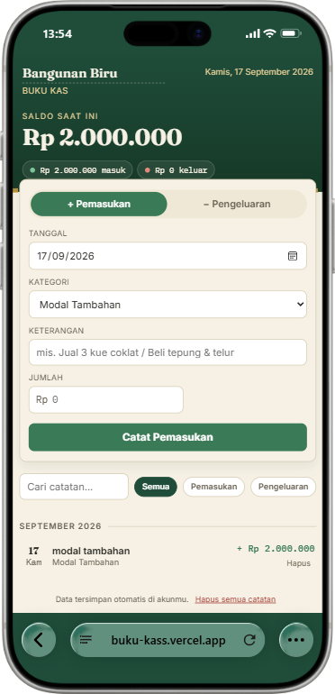

# Buku Kas — Catatan Usaha

Aplikasi web sederhana untuk mencatat pemasukan dan pengeluaran usaha kecil. Dibuat sebagai satu file HTML tanpa perlu server, framework, atau database — cukup buka dan langsung dipakai.

## Fitur

- **Catat transaksi** — Pemasukan (uang masuk) atau Pengeluaran (uang keluar) dengan tanggal, kategori, keterangan, dan jumlah.
- **Saldo otomatis** — Saldo, total pemasukan, dan total pengeluaran terhitung otomatis dan tampil di bagian atas.
- **Riwayat per bulan** — Transaksi dikelompokkan otomatis berdasarkan bulan.
- **Saldo berjalan** — Setiap baris transaksi menampilkan saldo kumulatifnya.
- **Cari & filter** — Cari berdasarkan keterangan/kategori, atau saring hanya pemasukan/pengeluaran.
- **Nama usaha** — Ubah nama usaha, tersimpan otomatis.
- **Mata uang Rupiah** — Format angka otomatis (Rp, pemisah ribuan).

## Cara Mengakses

Aplikasi ini adalah file statis murni (`buku-kas.html`) — data disimpan lewat API `window.storage` pada platform hosting tempat file ini dijalankan.

### Opsi 1: Jalankan di platform hosting (direkomendasikan)

Deploy `buku-kas.html` ke platform yang menyediakan API `window.storage` (misal hosting tanpa backend dengan penyimpanan data sisi klien). Setelah di-deploy, orang lain bisa langsung mengakses lewat URL-nya.

### Opsi 2: Buka lokal di browser

Buka file `buku-kas.html` langsung di browser. Jika API `window.storage` tidak tersedia di lingkungan tersebut, data hanya tersimpan di memori dan akan hilang saat halaman dimuat ulang (perilaku fallback: aplikasi tetap berjalan, tapi tanpa penyimpanan permanen).

## Cara Pakai

1. Buka aplikasi.
2. Isi **Nama usaha** (opsional) di pojok kiri atas.
3. Pilih **+ Pemasukan** atau **− Pengeluaran**, lalu isi tanggal, kategori, keterangan, dan jumlah.
4. Klik **Catat Pemasukan / Catat Pengeluaran**.
5. Data tersimpan otomatis. Untuk menghapus, arahkan kursor ke baris transaksi lalu klik **Hapus**.
6. Tombol **Hapus semua catatan** di bawah untuk mengosongkan seluruh data.

## Teknologi

- HTML + CSS + JavaScript murni (single file, tanpa dependensi eksternal selain Google Fonts).
- Responsif dan ramah perangkat seluler.
- Mendukung `prefers-reduced-motion` untuk pengguna yang sensitif terhadap animasi.

## Lisensi

Bebas digunakan dan dimodifikasi.
